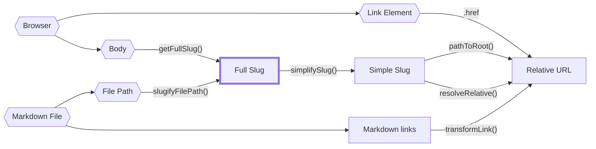
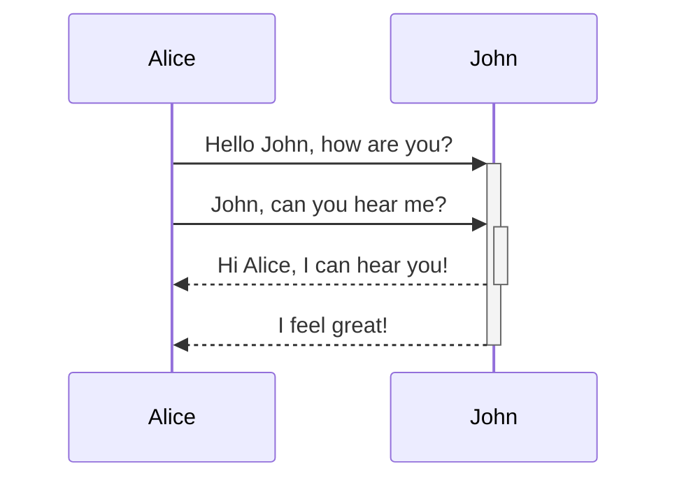

## Authoring Content
### Syntax

As Quartz uses Markdown files as the main way of writing content, it fully supports Markdown syntax. By default, Quartz also ships with a few syntax extensions like [Github Flavored Markdown](https://docs.github.com/en/get-started/writing-on-github/getting-started-with-writing-and-formatting-on-github/basic-writing-and-formatting-syntax) (footnotes, strikethrough, tables, tasklists) and [Obsidian Flavored Markdown](https://help.obsidian.md/Editing+and+formatting/Obsidian+Flavored+Markdown) ([[callouts]], [[wikilinks]]).

Quartz allows you to specify additional metadata in your notes called **frontmatter**.

Some common frontmatter fields that are natively supported by Quartz:

- `title`: Title of the page. If it isn't provided, Quartz will use the name of the file as the title.
- `aliases`: Other names for this note. This is a list of strings.
- `draft`: Whether to publish the page or not. This is one way to make pages private in Quartz.
- `date`: A string representing the day the note was published. Normally uses `YYYY-MM-DD` format.

### Syncing your Content

When your Quartz is at a point you're happy with, you can save your changes to GitHub by doing `npx quartz sync`.

> [!hint] Flags and options
> For full help options, you can run `npx quartz sync --help`.
>
> Most of these have sensible defaults but you can override them if you have a custom setup:
>
> - `-d` or `--directory`: the content folder. This is normally just `content`
> - `-v` or `--verbose`: print out extra logging information
> - `--commit` or `--no-commit`: whether to make a `git` commit for your changes
> - `--push` or `--no-push`: whether to push updates to your GitHub fork of Quartz
> - `--pull` or `--no-pull`: whether to try and pull in any updates from your GitHub fork (i.e. from other devices) before pushing

## Building

> [!hint] Flags and options
> For full help options, you can run `npx quartz build --help`.
>
> Most of these have sensible defaults but you can override them if you have a custom setup:
>
> - `-d` or `--directory`: the content folder. This is normally just `content`
> - `-v` or `--verbose`: print out extra logging information
> - `-o` or `--output`: the output folder. This is normally just `public`
> - `--serve`: run a local hot-reloading server to preview your Quartz
> - `--port`: what port to run the local preview server on
> - `--concurrency`: how many threads to use to parse notes

## Configuration

Most of the configuration you should need can be done by just editing `quartz.config.ts` or changing the layout in `quartz.layout.ts`.

> [!tip]
> If you edit Quartz configuration using a text-editor that has TypeScript language support like VSCode, it will warn you when you you've made an error in your configuration, helping you avoid configuration mistakes.

The configuration of Quartz can be broken down into two main parts:

```ts title="quartz.config.ts"
const config: QuartzConfig = {
  configuration: { ... },
  plugins: { ... },
}
```

### Plugins

You can think of Quartz plugins as a series of transformations over content.

![[quartz transform pipeline.png]]

```ts
plugins: {
  transformers: [...],
  filters: [...],
  emitters: [...],
}
```

- Transformers map over content (e.g. parsing frontmatter, generating a description)
- Filters filter content (e.g. filtering out drafts)
- Emitters reduce over content (e.g. creating an RSS feed or pages that list all files with a specific tag)

By adding, removing, and reordering plugins from the `tranformers`, `filters`, and `emitters` fields, you can customize the behaviour of Quartz.

> [!note]
> Each node is modified by every transformer in order. Some transformers are position-sensitive so you may need to take special note of whether it needs to come before or after any other particular plugins.

Additionally, plugins may also have their own configuration settings that you can pass in. For example, the Latex plugin allows you to pass in a field specifying the `renderEngine` to choose between Katex and MathJax.

```ts
transformers: [
  Plugin.FrontMatter(), // uses default options
  Plugin.Latex({ renderEngine: "katex" }), // specify some options
]
```

If you'd like to make your own plugins, read the guide on [[making plugins]] for more information.

## Hosting
### Netlify

1. Log in to the [Netlify dashboard](https://app.netlify.com/) and click "Add new site".
2. Select your Git provider and repository containing your Quartz project.
3. Under "Build command", enter `npx quartz build`.
4. Under "Publish directory", enter `public`.
5. Press Deploy. Once it's live, you'll have a `*.netlify.app` URL to view the page.
6. To add a custom domain, check "Domain management" in the left sidebar, just like with Vercel.

## Layout
Certain emitters may also output [HTML](https://developer.mozilla.org/en-US/docs/Web/HTML) files. To enable easy customization, these emitters allow you to fully rearrange the layout of the page. The default page layouts can be found in `quartz.layout.ts`.

Each page is composed of multiple different sections which contain `QuartzComponents`. The following code snippet lists all of the valid sections that you can add components to:

```typescript title="quartz/cfg.ts"
export interface FullPageLayout {
  head: QuartzComponent // single component
  header: QuartzComponent[] // laid out horizontally
  beforeBody: QuartzComponent[] // laid out vertically
  pageBody: QuartzComponent // single component
  left: QuartzComponent[] // vertical on desktop, horizontal on mobile
  right: QuartzComponent[] // vertical on desktop, horizontal on mobile
  footer: QuartzComponent // single component
}
```

These correspond to following parts of the page:

![[quartz layout.png|800]]

> [!note]
> There are two additional layout fields that are _not_ shown in the above diagram.
>
> 1. `head` is a single component that renders the `<head>` [tag](https://developer.mozilla.org/en-US/docs/Web/HTML/Element/head) in the HTML. This doesn't appear visually on the page and is only is responsible for metadata about the document like the tab title, scripts, and styles.
> 2. `header` is a set of components that are laid out horizontally and appears _before_ the `beforeBody` section. This enables you to replicate the old Quartz 3 header bar where the title, search bar, and dark mode toggle. By default, Quartz 4 doesn't place any components in the `header`.

Quartz **components**, like plugins, can take in additional properties as configuration options. If you're familiar with React terminology, you can think of them as Higher-order Components.

See [a list of all the components](component.md) for all available components along with their configuration options. You can also checkout the guide on [[creating components]] if you're interested in further customizing the behaviour of Quartz.

### Style

Most meaningful style changes like colour scheme and font can be done simply through the [[configuration#General Configuration|general configuration]] options. However, if you'd like to make more involved style changes, you can do this by writing your own styles. Quartz 4, like Quartz 3, uses [Sass](https://sass-lang.com/guide/) for styling.

You can see the base style sheet in `quartz/styles/base.scss` and write your own in `quartz/styles/custom.scss`.

> [!note]
> Some components may provide their own styling as well! For example, `quartz/components/Darkmode.tsx` imports styles from `quartz/components/styles/darkmode.scss`. If you'd like to customize styling for a specific component, double check the component definition to see how its styles are defined.

## Setting Up Github Repository

First, make sure you have Quartz [[index#🪴 Get Started|cloned and setup locally]].

Then, create a new repository on GitHub.com. Do **not** initialize the new repository with `README`, license, or `gitignore` files.

![[github-init-repo-options.png]]

At the top of your repository on GitHub.com's Quick Setup page, click the clipboard to copy the remote repository URL.

![[github-quick-setup.png]]

In your terminal of choice, navigate to the root of your Quartz folder. Then, run the following commands, replacing `REMOTE-URL` with the URL you just copied from the previous step.

```bash
# add your repository
git remote add origin REMOTE-URL

# track the main quartz repository for updates
git remote add upstream https://github.com/jackyzha0/quartz.git
```

To verify that you set the remote URL correctly, run the following command.

```bash
git remote -v
```

Then, you can sync the content to upload it to your repository.

```bash
npx quartz sync --no-pull
```

> [!hint]
> If `npx quartz sync` fails with `fatal: --[no-]autostash option is only valid with --rebase`, you
> may have an outdated version of `git`. Updating `git` should fix this issue.

## Showcases
Want to see what Quartz can do? Here are some cool community gardens:

- [Quartz Documentation (this site!)](https://quartz.jzhao.xyz/)
- [Jacky Zhao's Garden](https://jzhao.xyz/)
- [Socratica Toolbox](https://toolbox.socratica.info/)
- [Brandon Boswell's Garden](https://brandonkboswell.com)
- [Scaling Synthesis - A hypertext research notebook](https://scalingsynthesis.com/)
- [Data Dictionary 🧠](https://glossary.airbyte.com/)
- [sspaeti.com's Second Brain](https://brain.sspaeti.com/)
- [oldwinter の数字花园](https://garden.oldwinter.top/)
- [Abhijeet's Math Wiki](https://abhmul.github.io/quartz/Math-Wiki/)
- [Mike's AI Garden 🤖🪴](https://mwalton.me/)
- [Matt Dunn's Second Brain](https://mattdunn.info/)
- [Pelayo Arbues' Notes](https://pelayoarbues.github.io/)
- [Vince Imbat's Talahardin](https://vinceimbat.com/)
- [🧠🌳 Chad's Mind Garden](https://www.chadly.net/)
- [Pedro MC Fernandes's Topo da Mente](https://www.pmcf.xyz/topo-da-mente/)
- [Mau Camargo's Notkesto](https://notes.camargomau.com/)
- [Caicai's Novels](https://imoko.cc/blog/caicai/)
- [🌊 Collapsed Wave](https://collapsedwave.com/)
- [Aaron Pham's Garden](https://aarnphm.xyz/)
- [Sideny's 3D Artist's Handbook](https://sidney-eliot.github.io/3d-artists-handbook/)

If you want to see your own on here, submit a [Pull Request adding yourself to this file](https://github.com/jackyzha0/quartz/blob/v4/docs/showcase.md)!

## Upgrading
> [!note]
> This is specifically a guide for upgrading Quartz 4 version to a more recent update. If you are coming from Quartz 3, check out the [[migrating from Quartz 3|migration guide]] for more info.

To fetch the latest Quartz updates, simply run

```bash
npx quartz update
```

As Quartz uses [git](https://git-scm.com/) under the hood for versioning, updating effectively 'pulls' in the updates from the official Quartz GitHub repository. If you have local changes that might conflict with the updates, you may need to resolve these manually yourself (or, pull manually using `git pull origin upstream`).

> [!hint]
> Quartz will try to cache your content before updating to try and prevent merge conflicts. If you get a conflict mid-merge, you can stop the merge and then run `npx quartz restore` to restore your content from the cache.

If you have the [GitHub desktop app](https://desktop.github.com/), this will automatically open to help you resolve the conflicts. Otherwise, you will need to resolve this in a text editor like VSCode. For more help on resolving conflicts manually, check out the [GitHub guide on resolving merge conflicts](https://docs.github.com/en/pull-requests/collaborating-with-pull-requests/addressing-merge-conflicts/resolving-a-merge-conflict-using-the-command-line#competing-line-change-merge-c

## Advanced

### Architecture

Quartz is a static site generator. How does it work?

This question is best answered by tracing what happens when a user (you!) runs `npx quartz build` in the command line:

#### On the server

1. After running `npx quartz build`, npm will look at `package.json` to find the `bin` entry for `quartz` which points at `./quartz/bootstrap-cli.mjs`.
2. This file has a [shebang](<https://en.wikipedia.org/wiki/Shebang_(Unix)>) line at the top which tells npm to execute it using Node.
3. `bootstrap-cli.mjs` is responsible for a few things:
   1. Parsing the command-line arguments using [yargs](http://yargs.js.org/).
   2. Transpiling and bundling the rest of Quartz (which is in Typescript) to regular JavaScript using [esbuild](https://esbuild.github.io/). The `esbuild` configuration here is slightly special as it also handles `.scss` file imports using [esbuild-sass-plugin v2](https://www.npmjs.com/package/esbuild-sass-plugin). Additionally, we bundle 'inline' client-side scripts (any `.inline.ts` file) that components declare using a custom `esbuild` plugin that runs another instance of `esbuild` which bundles for the browser instead of `node`. Modules of both types are imported as plain text.
   3. Running the local preview server if `--serve` is set. This starts two servers:
      1. A WebSocket server on port 3001 to handle hot-reload signals. This tracks all inbound connections and sends a 'rebuild' message a server-side change is detected (either content or configuration).
      2. An HTTP file-server on a user defined port (normally 8080) to serve the actual website files.
   4. If the `--serve` flag is set, it also starts a file watcher to detect source-code changes (e.g. anything that is `.ts`, `.tsx`, `.scss`, or packager files). On a change, we rebuild the module (step 2 above) using esbuild's [rebuild API](https://esbuild.github.io/api/#rebuild) which drastically reduces the build times.
   5. After transpiling the main Quartz build module (`quartz/build.ts`), we write it to a cache file `.quartz-cache/transpiled-build.mjs` and then dynamically import this using `await import(cacheFile)`. However, we need to be pretty smart about how to bust Node's [import cache](https://github.com/nodejs/modules/issues/307) so we add a random query string to fake Node into thinking it's a new module. This does, however, cause memory leaks so we just hope that the user doesn't hot-reload their configuration too many times in a single session :)) (it leaks about ~350kB memory on each reload). After importing the module, we then invoke it, passing in the command line arguments we parsed earlier along with a callback function to signal the client to refresh.
4. In `build.ts`, we start by installing source map support manually to account for the query string cache busting hack we introduced earlier. Then, we start processing content:
   1. Clean the output directory.
   2. Recursively glob all files in the `content` folder, respecting the `.gitignore`.
   3. Parse the Markdown files.
      1. Quartz detects the number of threads available and chooses to spawn worker threads if there are >128 pieces of content to parse (rough heuristic). If it needs to spawn workers, it will invoke esbuild again to transpile the worker script `quartz/worker.ts`. Then, a work-stealing [workerpool](https://www.npmjs.com/package/workerpool) is then created and batches of 128 files are assigned to workers.
      2. Each worker (or just the main thread if there is no concurrency) creates a [unified](https://github.com/unifiedjs/unified) parser based off of the plugins defined in the [[configuration]].
      3. Parsing has three steps:
         1. Read the file into a [vfile](https://github.com/vfile/vfile).
         2. Applied plugin-defined text transformations over the content.
         3. Slugify the file path and store it in the data for the file. See the page on [[paths]] for more details about how path logic works in Quartz (spoiler: its complicated).
         4. Markdown parsing using [remark-parse](https://www.npmjs.com/package/remark-parse) (text to [mdast](https://github.com/syntax-tree/mdast)).
         5. Apply plugin-defined Markdown-to-Markdown transformations.
         6. Convert Markdown into HTML using [remark-rehype](https://github.com/remarkjs/remark-rehype) ([mdast](https://github.com/syntax-tree/mdast) to [hast](https://github.com/syntax-tree/hast)).
         7. Apply plugin-defined HTML-to-HTML transformations.
   4. Filter out unwanted content using plugins.
   5. Emit files using plugins.
      1. Gather all the static resources (e.g. external CSS, JS modules, etc.) each emitter plugin declares.
      2. Emitters that emit HTML files do a bit of extra work here as they need to transform the [hast](https://github.com/syntax-tree/hast) produced in the parse step to JSX. This is done using [hast-util-to-jsx-runtime](https://github.com/syntax-tree/hast-util-to-jsx-runtime) with the [Preact](https://preactjs.com/) runtime. Finally, the JSX is rendered to HTML using [preact-render-to-string](https://github.com/preactjs/preact-render-to-string) which statically renders the JSX to HTML (i.e. doesn't care about `useState`, `useEffect`, or any other React/Preact interactive bits). Here, we also do a bunch of fun stuff like assemble the page [[layout]] from `quartz.layout.ts`, assemble all the inline scripts that actually get shipped to the client, and all the transpiled styles. The bulk of this logic can be found in `quartz/components/renderPage.tsx`. Other fun things of note:
         1. CSS is minified and transformed using [Lightning CSS](https://github.com/parcel-bundler/lightningcss) to add vendor prefixes and do syntax lowering.
         2. Scripts are split into `beforeDOMLoaded` and `afterDOMLoaded` and are inserted in the `<head>` and `<body>` respectively.
      3. Finally, each emitter plugin is responsible for emitting and writing it's own emitted files to disk.
   6. If the `--serve` flag was detected, we also set up another file watcher to detect content changes (only `.md` files). We keep a content map that tracks the parsed AST and plugin data for each slug and update this on file changes. Newly added or modified paths are rebuilt and added to the content map. Then, all the filters and emitters are run over the resulting content map. This file watcher is debounced with a threshold of 250ms. On success, we send a client refresh signal using the passed in callback function.

#### On the client

1. The browser opens a Quartz page and loads the HTML. The `<head>` also links to page styles (emitted to `public/index.css`) and page-critical JS (emitted to `public/prescript.js`)
2. Then, once the body is loaded, the browser loads the non-critical JS (emitted to `public/postscript.js`)
3. Once the page is done loading, the page will then dispatch a custom synthetic browser event `"nav"`. This is used so client-side scripts declared by components can 'setup' anything that requires access to the page DOM.
   1. If the [[SPA Routing|enableSPA option]] is enabled in the [[configuration]], this `"nav"` event is also fired on any client-navigation to allow for components to unregister and reregister any event handlers and state.
   2. If it's not, we wire up the `"nav"` event to just be fired a single time after page load to allow for consistency across how state is setup across both SPA and non-SPA contexts.

The architecture and design of the plugin system was intentionally left pretty vague here as this is described in much more depth in the guide on [[making plugins|making your own plugin]].

### Creating Components
> [!warning]
> This guide assumes you have experience writing JavaScript and are familiar with TypeScript.

Normally on the web, we write layout code using HTML which looks something like the following:

```html
<article>
  <h1>An article header</h1>
  <p>Some content</p>
</article>
```

This piece of HTML represents an article with a leading header that says "An article header" and a paragraph that contains the text "Some content". This is combined with CSS to style the page and JavaScript to add interactivity.

However, HTML doesn't let you create reusable templates. If you wanted to create a new page, you would need to copy and paste the above snippet and edit the header and content yourself. This isn't great if we have a lot of content on our site that shares a lot of similar layout. The smart people who created React also had similar complaints and invented the concept of Components -- JavaScript functions that return JSX -- to solve the code duplication problem.

In effect, components allow you to write a JavaScript function that takes some data and produces HTML as an output. **While Quartz doesn't use React, it uses the same component concept to allow you to easily express layout templates in your Quartz site.**

#### An Example Component

##### Constructor

Component files are written in `.tsx` files that live in the `quartz/components` folder. These are re-exported in `quartz/components/index.ts` so you can use them in layouts and other components more easily.

Each component file should have a default export that satisfies the `QuartzComponentConstructor` function signature. It's a function that takes in a single optional parameter `opts` and returns a Quartz Component. The type of the parameters `opts` is defined by the interface `Options` which you as the component creator also decide.

In your component, you can use the values from the configuration option to change the rendering behaviour inside of your component. For example, the component in the code snippet below will not render if the `favouriteNumber` option is below 0.

```tsx {11-17}
interface Options {
  favouriteNumber: number
}

const defaultOptions: Options = {
  favouriteNumber: 42,
}

export default ((userOpts?: Options) => {
  const opts = { ...userOpts, ...defaultOpts }
  function YourComponent(props: QuartzComponentProps) {
    if (opts.favouriteNumber < 0) {
      return null
    }

    return <p>My favourite number is {opts.favouriteNumber}</p>
  }

  return YourComponent
}) satisfies QuartzComponentConstructor
```

##### Props

The Quartz component itself (lines 11-17 highlighted above) looks like a React component. It takes in properties (sometimes called [props](https://react.dev/learn/passing-props-to-a-component)) and returns JSX.

All Quartz components accept the same set of props:

```tsx title="quartz/components/types.ts"
// simplified for sake of demonstration
export type QuartzComponentProps = {
  fileData: QuartzPluginData
  cfg: GlobalConfiguration
  tree: Node<QuartzPluginData>
  allFiles: QuartzPluginData[]
  displayClass?: "mobile-only" | "desktop-only"
}
```

- `fileData`: Any metadata [[making plugins|plugins]] may have added to the current page.
  - `fileData.slug`: slug of the current page.
  - `fileData.frontmatter`: any frontmatter parsed.
- `cfg`: The `configuration` field in `quartz.config.ts`.
- `tree`: the resulting [HTML AST](https://github.com/syntax-tree/hast) after processing and transforming the file. This is useful if you'd like to render the content using [hast-util-to-jsx-runtime](https://github.com/syntax-tree/hast-util-to-jsx-runtime) (you can find an example of this in `quartz/components/pages/Content.tsx`).
- `allFiles`: Metadata for all files that have been parsed. Useful for doing page listings or figuring out the overall site structure.
- `displayClass`: a utility class that indicates a preference from the user about how to render it in a mobile or desktop setting. Helpful if you want to conditionally hide a component on mobile or desktop.

##### Styling

Quartz components can also define a `.css` property on the actual function component which will get picked up by Quartz. This is expected to be a CSS string which can either be inlined or imported from a `.scss` file.

Note that inlined styles **must** be plain vanilla CSS:

```tsx {6-10} title="quartz/components/YourComponent.tsx"
export default (() => {
  function YourComponent() {
    return <p class="red-text">Example Component</p>
  }

  YourComponent.css = `
  p.red-text {
    color: red;
  }
  `

  return YourComponent
}) satisfies QuartzComponentConstructor
```

Imported styles, however, can be from SCSS files:

```tsx {1-2,9} title="quartz/components/YourComponent.tsx"
// assuming your stylesheet is in quartz/components/styles/YourComponent.scss
import styles from "./styles/YourComponent.scss"

export default (() => {
  function YourComponent() {
    return <p>Example Component</p>
  }

  YourComponent.css = styles
  return YourComponent
}) satisfies QuartzComponentConstructor
```

> [!warning]
> Quartz does not use CSS modules so any styles you declare here apply _globally_. If you only want it to apply to your component, make sure you use specific class names and selectors.

##### Scripts and Interactivity

What about interactivity? Suppose you want to add an-click handler for example. Like the `.css` property on the component, you can also declare `.beforeDOMLoaded` and `.afterDOMLoaded` properties that are strings that contain the script.

```tsx title="quartz/components/YourComponent.tsx"
export default (() => {
  function YourComponent() {
    return <button id="btn">Click me</button>
  }

  YourComponent.beforeDOM = `
  console.log("hello from before the page loads!")
  `

  YourComponent.afterDOM = `
  document.getElementById('btn').onclick = () => {
    alert('button clicked!')
  }
  `
  return YourComponent
}) satisfies QuartzComponentConstructor
```

> [!hint]
> For those coming from React, Quartz components are different from React components in that it only uses JSX for templating and layout. Hooks like `useEffect`, `useState`, etc. are not rendered and other properties that accept functions like `onClick` handlers will not work. Instead, do it using a regular JS script that modifies the DOM element directly.

As the names suggest, the `.beforeDOMLoaded` scripts are executed _before_ the page is done loading so it doesn't have access to any elements on the page. This is mostly used to prefetch any critical data.

The `.afterDOMLoaded` script executes once the page has been completely loaded. This is a good place to setup anything that should last for the duration of a site visit (e.g. getting something saved from local storage).

If you need to create an `afterDOMLoaded` script that depends on _page specific_ elements that may change when navigating to a new page, you can listen for the `"nav"` event that gets fired whenever a page loads (which may happen on navigation if [[SPA Routing]] is enabled).

```ts
document.addEventListener("nav", () => {
  // do page specific logic here
  // e.g. attach event listeners
  const toggleSwitch = document.querySelector("#switch") as HTMLInputElement
  toggleSwitch.removeEventListener("change", switchTheme)
  toggleSwitch.addEventListener("change", switchTheme)
})
```

It is best practice to also unmount any existing event handlers to prevent memory leaks.

###### Importing Code

Of course, it isn't always practical (nor desired!) to write your code as a string literal in the component.

Quartz supports importing component code through `.inline.ts` files.

```tsx title="quartz/components/YourComponent.tsx"
// @ts-ignore: typescript doesn't know about our inline bundling system
// so we need to silence the error
import script from "./scripts/graph.inline"

export default (() => {
  function YourComponent() {
    return <button id="btn">Click me</button>
  }

  YourComponent.afterDOM = script
  return YourComponent
}) satisfies QuartzComponentConstructor
```

```ts title="quartz/components/scripts/graph.inline.ts"
// any imports here are bundled for the browser
import * as d3 from "d3"

document.getElementById("btn").onclick = () => {
  alert("button clicked!")
}
```

Additionally, like what is shown in the example above, you can import packages in `.inline.ts` files. This will be bundled by Quartz and included in the actual script.

##### Using a Component

After creating your custom component, re-export it in `quartz/components/index.ts`:

```ts title="quartz/components/index.ts" {4,10}
import ArticleTitle from "./ArticleTitle"
import Content from "./pages/Content"
import Darkmode from "./Darkmode"
import YourComponent from "./YourComponent"

export { ArticleTitle, Content, Darkmode, YourComponent }
```

Then, you can use it like any other component in `quartz.layout.ts` via `Component.YourComponent()`. See the [[configuration#Layout|layout]] section for more details.

As Quartz components are just functions that return React components, you can compositionally use them in other Quartz components.

```tsx title="quartz/components/AnotherComponent.tsx"
import YourComponent from "./YourComponent"

export default (() => {
  function AnotherComponent(props: QuartzComponentProps) {
    return (
      <div>
        <p>It's nested!</p>
        <YourComponent {...props} />
      </div>
    )
  }

  return AnotherComponent
}) satisfies QuartzComponentConstructor
```

> [!hint]
> Look in `quartz/components` for more examples of components in Quartz as reference for your own components!

### Making Plugins
> [!warning]
> This part of the documentation will assume you have working knowledge in TypeScript and will include code snippets that describe the interface of what Quartz plugins should look like.

Quartz's plugins are a series of transformations over content. This is illustrated in the diagram of the processing pipeline below:

![[quartz transform pipeline.png]]

All plugins are defined as a function that takes in a single parameter for options `type OptionType = object | undefined` and return an object that corresponds to the type of plugin it is.

```ts
type OptionType = object | undefined
type QuartzPlugin<Options extends OptionType = undefined> = (opts?: Options) => QuartzPluginInstance
type QuartzPluginInstance =
  | QuartzTransformerPluginInstance
  | QuartzFilterPluginInstance
  | QuartzEmitterPluginInstance
```

The following sections will go into detail for what methods can be implemented for each plugin type. Before we do that, let's clarify a few more ambiguous types:

- `BuildCtx` is defined in `quartz/ctx.ts`. It consists of
  - `argv`: The command line arguments passed to the Quartz [[build]] command
  - `cfg`: The full Quartz [[configuration]]
  - `allSlugs`: a list of all the valid content slugs (see [[paths]] for more information on what a `ServerSlug` is)
- `StaticResources` is defined in `quartz/resources.tsx`. It consists of
  - `css`: a list of URLs for stylesheets that should be loaded
  - `js`: a list of scripts that should be loaded. A script is described with the `JSResource` type which is also defined in `quartz/resources.tsx`. It allows you to define a load time (either before or after the DOM has been loaded), whether it should be a module, and either the source URL or the inline content of the script.

#### Transformers

Transformers **map** over content, taking a Markdown file and outputting modified content or adding metadata to the file itself.

```ts
export type QuartzTransformerPluginInstance = {
  name: string
  textTransform?: (ctx: BuildCtx, src: string | Buffer) => string | Buffer
  markdownPlugins?: (ctx: BuildCtx) => PluggableList
  htmlPlugins?: (ctx: BuildCtx) => PluggableList
  externalResources?: (ctx: BuildCtx) => Partial<StaticResources>
}
```

All transformer plugins must define at least a `name` field to register the plugin and a few optional functions that allow you to hook into various parts of transforming a single Markdown file.

- `textTransform` performs a text-to-text transformation _before_ a file is parsed into the [Markdown AST](https://github.com/syntax-tree/mdast).
- `markdownPlugins` defines a list of [remark plugins](https://github.com/remarkjs/remark/blob/main/doc/plugins.md). `remark` is a tool that transforms Markdown to Markdown in a structured way.
- `htmlPlugins` defines a list of [rehype plugins](https://github.com/rehypejs/rehype/blob/main/doc/plugins.md). Similar to how `remark` works, `rehype` is a tool that transforms HTML to HTML in a structured way.
- `externalResources` defines any external resources the plugin may need to load on the client-side for it to work properly.

Normally for both `remark` and `rehype`, you can find existing plugins that you can use to . If you'd like to create your own `remark` or `rehype` plugin, checkout the [guide to creating a plugin](https://unifiedjs.com/learn/guide/create-a-plugin/) using `unified` (the underlying AST parser and transformer library).

A good example of a transformer plugin that borrows from the `remark` and `rehype` ecosystems is the [[Latex]] plugin:

```ts title="quartz/plugins/transformers/latex.ts"
import remarkMath from "remark-math"
import rehypeKatex from "rehype-katex"
import rehypeMathjax from "rehype-mathjax/svg.js"
import { QuartzTransformerPlugin } from "../types"

interface Options {
  renderEngine: "katex" | "mathjax"
}

export const Latex: QuartzTransformerPlugin<Options> = (opts?: Options) => {
  const engine = opts?.renderEngine ?? "katex"
  return {
    name: "Latex",
    markdownPlugins() {
      return [remarkMath]
    },
    htmlPlugins() {
      if (engine === "katex") {
        // if you need to pass options into a plugin, you
        // can use a tuple of [plugin, options]
        return [[rehypeKatex, { output: "html" }]]
      } else {
        return [rehypeMathjax]
      }
    },
    externalResources() {
      if (engine === "katex") {
        return {
          css: ["https://cdn.jsdelivr.net/npm/katex@0.16.0/dist/katex.min.css"],
          js: [
            {
              src: "https://cdn.jsdelivr.net/npm/katex@0.16.7/dist/contrib/copy-tex.min.js",
              loadTime: "afterDOMReady",
              contentType: "external",
            },
          ],
        }
      } else {
        return {}
      }
    },
  }
}
```

Another common thing that transformer plugins will do is parse a file and add extra data for that file:

```ts
export const AddWordCount: QuartzTransformerPlugin = () => {
  return {
    name: "AddWordCount",
    markdownPlugins() {
      return [
        () => {
          return (tree, file) => {
            // tree is an `mdast` root element
            // file is a `vfile`
            const text = file.value
            const words = text.split(" ").length
            file.data.wordcount = words
          }
        },
      ]
    },
  }
}

// tell typescript about our custom data fields we are adding
// other plugins will then also be aware of this data field
declare module "vfile" {
  interface DataMap {
    wordcount: number
  }
}
```

Finally, you can also perform transformations over Markdown or HTML ASTs using the `visit` function from the `unist-util-visit` package or the `findAndReplace` function from the `mdast-util-find-and-replace` package.

```ts
export const TextTransforms: QuartzTransformerPlugin = () => {
  return {
    name: "TextTransforms",
    markdownPlugins() {
      return [() => {
        return (tree, file) => {
          // replace _text_ with the italics version
          findAndReplace(tree, /_(.+)_/, (_value: string, ...capture: string[]) => {
            // inner is the text inside of the () of the regex
            const [inner] = capture
            // return an mdast node
            // https://github.com/syntax-tree/mdast
            return {
              type: "emphasis",
              children: [{ type: 'text', value: inner }]
            }
          })

         // remove all links (replace with just the link content)
         // match by 'type' field on an mdast node
         // https://github.com/syntax-tree/mdast#link in this example
          visit(tree, "link", (link: Link) => {
            return {
              type: "paragraph"
              children: [{ type: 'text', value: link.title }]
            }
          })
        }
      }]
    }
  }
}
```

All transformer plugins can be found under `quartz/plugins/transformers`. If you decide to write your own transformer plugin, don't forget to re-export it under `quartz/plugins/transformers/index.ts`

A parting word: transformer plugins are quite complex so don't worry if you don't get them right away. Take a look at the built in transformers and see how they operate over content to get a better sense for how to accomplish what you are trying to do.

#### Filters

Filters **filter** content, taking the output of all the transformers and determining what files to actually keep and what to discard.

```ts
export type QuartzFilterPlugin<Options extends OptionType = undefined> = (
  opts?: Options,
) => QuartzFilterPluginInstance

export type QuartzFilterPluginInstance = {
  name: string
  shouldPublish(ctx: BuildCtx, content: ProcessedContent): boolean
}
```

A filter plugin must define a `name` field and a `shouldPublish` function that takes in a piece of content that has been processed by all the transformers and returns a `true` or `false` depending on whether it should be passed to the emitter plugins or not.

For example, here is the built-in plugin for removing drafts:

```ts title="quartz/plugins/filters/draft.ts"
import { QuartzFilterPlugin } from "../types"

export const RemoveDrafts: QuartzFilterPlugin<{}> = () => ({
  name: "RemoveDrafts",
  shouldPublish(_ctx, [_tree, vfile]) {
    // uses frontmatter parsed from transformers
    const draftFlag: boolean = vfile.data?.frontmatter?.draft ?? false
    return !draftFlag
  },
})
```

#### Emitters

Emitters **reduce** over content, taking in a list of all the transformed and filtered content and creating output files.

```ts
export type QuartzEmitterPlugin<Options extends OptionType = undefined> = (
  opts?: Options,
) => QuartzEmitterPluginInstance

export type QuartzEmitterPluginInstance = {
  name: string
  emit(
    ctx: BuildCtx,
    content: ProcessedContent[],
    resources: StaticResources,
    emitCallback: EmitCallback,
  ): Promise<FilePath[]>
  getQuartzComponents(ctx: BuildCtx): QuartzComponent[]
}
```

An emitter plugin must define a `name` field an `emit` function and a `getQuartzComponents` function. `emit` is responsible for looking at all the parsed and filtered content and then appropriately creating files and returning a list of paths to files the plugin created.

Creating new files can be done via regular Node [fs module](https://nodejs.org/api/fs.html) (i.e. `fs.cp` or `fs.writeFile`) or via the `emitCallback` if you are creating files that contain text. The `emitCallback` function is the 4th argument of the emit function. Its interface looks something like this:

```ts
export type EmitCallback = (data: {
  // the name of the file to emit (not including the file extension)
  slug: ServerSlug
  // the file extension
  ext: `.${string}` | ""
  // the file content to add
  content: string
}) => Promise<FilePath>
```

This is a thin wrapper around writing to the appropriate output folder and ensuring that intermediate directories exist. If you choose to use the native Node `fs` APIs, ensure you emit to the `argv.output` folder as well.

If you are creating an emitter plugin that needs to render components, there are three more things to be aware of:

- Your component should use `getQuartzComponents` to declare a list of `QuartzComponents` that it uses to construct the page. See the page on [[creating components]] for more information.
- You can use the `renderPage` function defined in `quartz/components/renderPage.tsx` to render Quartz components into HTML.
- If you need to render an HTML AST to JSX, you can use the `htmlToJsx` function from `quartz/util/jsx.ts`. An example of this can be found in `quartz/components/pages/Content.tsx`.

For example, the following is a simplified version of the content page plugin that renders every single page.

```tsx title="quartz/plugins/emitters/contentPage.tsx"
export const ContentPage: QuartzEmitterPlugin = () => {
  // construct the layout
  const layout: FullPageLayout = {
    ...sharedPageComponents,
    ...defaultContentPageLayout,
    pageBody: Content(),
  }
  const { head, header, beforeBody, pageBody, left, right, footer } = layout
  return {
    name: "ContentPage",
    getQuartzComponents() {
      return [head, ...header, ...beforeBody, pageBody, ...left, ...right, footer]
    },
    async emit(ctx, content, resources, emit): Promise<FilePath[]> {
      const cfg = ctx.cfg.configuration
      const fps: FilePath[] = []
      const allFiles = content.map((c) => c[1].data)
      for (const [tree, file] of content) {
        const slug = canonicalizeServer(file.data.slug!)
        const externalResources = pageResources(slug, resources)
        const componentData: QuartzComponentProps = {
          fileData: file.data,
          externalResources,
          cfg,
          children: [],
          tree,
          allFiles,
        }

        const content = renderPage(slug, componentData, opts, externalResources)
        const fp = await emit({
          content,
          slug: file.data.slug!,
          ext: ".html",
        })

        fps.push(fp)
      }
      return fps
    },
  }
}
```

Note that it takes in a `FullPageLayout` as the options. It's made by combining a `SharedLayout` and a `PageLayout` both of which are provided through the `quartz.layout.ts` file.

> [!hint]
> Look in `quartz/plugins` for more examples of plugins in Quartz as reference for your own plugins!

### Paths
Paths are pretty complex to reason about because, especially for a static site generator, they can come from so many places.

A full file path to a piece of content? Also a path. What about a slug for a piece of content? Yet another path.

It would be silly to type these all as `string` and call it a day as it's pretty common to accidentally mistake one type of path for another. Unfortunately, TypeScript does not have [nominal types](https://en.wikipedia.org/wiki/Nominal_type_system) for type aliases meaning even if you made custom types of a server-side slug or a client-slug slug, you can still accidentally assign one to another and TypeScript wouldn't catch it.

Luckily, we can mimic nominal typing using [brands](https://www.typescriptlang.org/play#example/nominal-typing).

```typescript
// instead of
type FullSlug = string

// we do
type FullSlug = string & { __brand: "full" }

// that way, the following will fail typechecking
const slug: FullSlug = "some random string"
```

While this prevents most typing mistakes _within_ our nominal typing system (e.g. mistaking a server slug for a client slug), it doesn't prevent us from _accidentally_ mistaking a string for a client slug when we forcibly cast it.

Thus, we still need to be careful when casting from a string to one of these nominal types in the 'entrypoints', illustrated with hexagon shapes in the diagram below.

The following diagram draws the relationships between all the path sources, nominal path types, and what functions in `quartz/path.ts` convert between them.



Here are the main types of slugs with a rough description of each type of path:

- `FilePath`: a real file path to a file on disk. Cannot be relative and must have a file extension.
- `FullSlug`: cannot be relative and may not have leading or trailing slashes. It can have `index` as it's last segment. Use this wherever possible is it's the most 'general' interpretation of a slug.
- `SimpleSlug`: cannot be relative and shouldn't have `/index` as an ending or a file extension. It _can_ however have a trailing slash to indicate a folder path.
- `RelativeURL`: must start with `.` or `..` to indicate it's a relative URL. Shouldn't have `/index` as an ending or a file extension but can contain a trailing slash.

To get a clearer picture of how these relate to each other, take a look at the path tests in `quartz/path.test.ts`.

## Features
### Docker Support
Quartz comes shipped with a Docker image that will allow you to preview your Quartz locally without installing Node.

You can run the below one-liner to run Quartz in Docker.

```sh
docker run --rm -itp 8080:8080 $(docker build -q .)
```

### Latex
Quartz uses [Katex](https://katex.org/) by default to typeset both inline and block math expressions at build time.

#### Syntax

##### Block Math

Block math can be rendered by delimiting math expression with `$$`.

```
$$
f(x) = \int_{-\infty}^\infty
    f\hat(\xi),e^{2 \pi i \xi x}
    \,d\xi
$$
```

$$
f(x) = \int_{-\infty}^\infty
    f\hat(\xi),e^{2 \pi i \xi x}
    \,d\xi
$$

$$
\begin{aligned}
a &= b + c \\ &= e + f \\
\end{aligned}
$$

$$
\begin{bmatrix}
1 & 2 & 3 \\
a & b & c
\end{bmatrix}
$$

##### Inline Math

Similarly, inline math can be rendered by delimiting math expression with a single `$`. For example, `$e^{i\pi} = -1$` produces $e^{i\pi} = -1$

##### Escaping symbols

There will be cases where you may have more than one `$` in a paragraph at once which may accidentally trigger MathJax/Katex.

To get around this, you can escape the dollar sign by doing `\$` instead.

For example:

- Incorrect: `I have $1 and you have $2` produces I have $1 and you have $2
- Correct: `I have \$1 and you have \$2` produces I have \$1 and you have \$2

#### MathJax

In `quartz.config.ts`, you can configure Quartz to use [MathJax SVG rendering](https://docs.mathjax.org/en/latest/output/svg.html) by replacing `Plugin.Latex({ renderEngine: 'katex' })` with `Plugin.Latex({ renderEngine: 'mathjax' })`

#### Customization

- Removing Latex support: remove all instances of `Plugin.Latex()` from `quartz.config.ts`.
- Plugin: `quartz/plugins/transformers/latex.ts`

### Mermaid Diagrams
Quartz supports Mermaid which allows you to add diagrams and charts to your notes. Mermaid supports a range of diagrams, such as [flow charts](https://mermaid.js.org/syntax/flowchart.html), [sequence diagrams](https://mermaid.js.org/syntax/sequenceDiagram.html), and [timelines](https://mermaid.js.org/syntax/timeline.html). This is enabled as a part of [[Obsidian compatibility]] and can be configured and enabled/disabled from that plugin.

By default, Quartz will render Mermaid diagrams to match the site theme.

> [!warning]
> Wondering why Mermaid diagrams may not be showing up even if you have them enabled? You may need to reorder your plugins so that `Plugin.ObsidianFlavoredMarkdown()` is _after_ `Plugin.SyntaxHighlighting()`.

#### Syntax

To add a Mermaid diagram, create a mermaid code block.

````

````


### Obsidian Compatibility
Quartz was originally designed as a tool to publish Obsidian vaults as websites. Even as the scope of Quartz has widened over time, it hasn't lost the ability to seamlessly interoperate with Obsidian.

By default, Quartz ships with `Plugin.ObsidianFlavoredMarkdown` which is a transformer plugin that adds support for [Obsidian Flavored Markdown](https://help.obsidian.md/Editing+and+formatting/Obsidian+Flavored+Markdown). This includes support for features like [[wikilinks]] and [[Mermaid diagrams]].

It also ships with support for [frontmatter parsing](https://help.obsidian.md/Editing+and+formatting/Properties) with the same fields that Obsidian uses through the `Plugin.FrontMatter` transformer plugin.

Finally, Quartz also provides `Plugin.CrawlLinks` which allows you to customize Quartz's link resolution behaviour to match Obsidian.

#### Configuration

- Frontmatter parsing:
  - Disabling: remove all instances of `Plugin.FrontMatter()` from `quartz.config.ts`.
  - Customize default values for frontmatter: edit `quartz/plugins/transformers/frontmatter.ts`
- Obsidian Flavored Markdown:
  - Disabling: remove all instances of `Plugin.ObsidianFlavoredMarkdown()` from `quartz.config.ts`
  - Customizing features: `Plugin.ObsidianFlavoredMarkdown` has several other options to toggle on and off:
    - `comments`: whether to enable `%%` style Obsidian comments. Defaults to `true`
    - `highlight`: whether to enable `==` style highlights. Defaults to `true`
    - `wikilinks`: whether to enable turning [[wikilinks]] into regular links. Defaults to `true`
    - `callouts`: whether to enable [[callouts]]. Defaults to `true`
    - `mermaid`: whether to enable [[Mermaid diagrams]]. Defaults to `true`
    - `parseTags`: whether to try and parse tags in the content body. Defaults to `true`
    - `enableInHtmlEmbed`: whether to try and parse Obsidian flavoured markdown in raw HTML. Defaults to `false`
    - `enableYouTubeEmbed`: whether to enable embedded YouTube videos using external image Markdown syntax. Defaults to `false`
- Link resolution behaviour:
  - Disabling: remove all instances of `Plugin.CrawlLinks()` from `quartz.config.ts`
  - Changing link resolution preference: set `markdownLinkResolution` to one of `absolute`, `relative` or `shortest`

### OxHugo Compatibility
[org-roam](https://www.orgroam.com/) is a plain-text personal knowledge management system for [emacs](https://en.wikipedia.org/wiki/Emacs). [ox-hugo](https://github.com/kaushalmodi/ox-hugo) is org exporter backend that exports `org-mode` files to [Hugo](https://gohugo.io/) compatible Markdown.

Because the Markdown generated by ox-hugo is not pure Markdown but Hugo specific, we need to transform it to fit into Quartz. This is done by `Plugin.OxHugoFlavouredMarkdown`. Even though this [[making plugins|plugin]] was written with `ox-hugo` in mind, it should work for any Hugo specific Markdown.

```typescript title="quartz.config.ts"
plugins: {
  transformers: [
    Plugin.FrontMatter({ delims: "+++", language: "toml" }), // if toml frontmatter
    // ...
    Plugin.OxHugoFlavouredMarkdown(),
    Plugin.GitHubFlavoredMarkdown(),
    // ...
  ],
},
```

#### Usage

Quartz by default doesn't understand `org-roam` files as they aren't Markdown. You're responsible for using an external tool like `ox-hugo` to export the `org-roam` files as Markdown content to Quartz and managing the static assets so that they're available in the final output.

#### Configuration

- Link resolution
  - `wikilinks`: Whether to replace `{{ relref }}` with Quartz [[wikilinks]]
  - `removePredefinedAnchor`: Whether to remove [pre-defined anchor set by ox-hugo](https://ox-hugo.scripter.co/doc/anchors/).
- Image handling
  - `replaceFigureWithMdImg`: Whether to replace `<figure/>` with ``
- Formatting
  - `removeHugoShortcode`: Whether to remove hugo shortcode syntax (`{{}}`)
  - `replaceOrgLatex`: Whether to replace org-mode formatting for latex fragments with what `Plugin.Latex` supports.

> [!warning]
>
> While you can use `Plugin.OxHugoFlavoredMarkdown` and `Plugin.ObsidianFlavoredMarkdown` together, it's not recommended because it might mutate the file in unexpected ways. Use with caution.

### RSS Feed
Quartz creates an RSS feed for all the content on your site by generating an `index.xml` file that RSS readers can subscribe to. Because of the RSS spec, this requires the `baseUrl` property in your [[configuration]] to be set properly for RSS readers to pick it up properly.

#### Configuration
- Remove RSS feed: set the `enableRSS` field of `Plugin.ContentIndex` in `quartz.config.ts` to be `false`.
- Change number of entries: set the `rssLimit` field of `Plugin.ContentIndex` to be the desired value. It defaults to latest 10 items.
- Use rich HTML output in RSS: set `rssFullHtml` field of `Plugin.ContentIndex` to be `true`.

### SPA Routing
Single-page-app style rendering. This prevents flashes of unstyled content and improves the smoothness of Quartz.

Under the hood, this is done by hijacking page navigations and instead fetching the HTML via a `GET` request and then diffing and selectively replacing parts of the page using [micromorph](https://github.com/natemoo-re/micromorph). This allows us to change the content of the page without fully refreshing the page, reducing the amount of content that the browser needs to load.

#### Configuration

- Disable SPA Routing: set the `enableSPA` field of the [[configuration]] in `quartz.config.ts` to be `false`.

### Backlinks
A backlink for a note is a link from another note to that note. Links in the backlink pane also feature rich [[popover previews]] if you have that feature enabled.

#### Customization

- Removing backlinks: delete all usages of `Component.Backlinks()` from `quartz.layout.ts`.
- Component: `quartz/components/Backlinks.tsx`
- Style: `quartz/components/styles/backlinks.scss`
- Script: `quartz/components/scripts/search.inline.ts`

### Breadcrumbs
Breadcrumbs provide a way to navigate a hierarchy of pages within your site using a list of its parent folders.

By default, the element at the very top of your page is the breadcrumb navigation bar (can also be seen at the top on this page!).

#### Customization

Most configuration can be done by passing in options to `Component.Breadcrumbs()`.

For example, here's what the default configuration looks like:

```typescript title="quartz.layout.ts"
Component.Breadcrumbs({
  spacerSymbol: "❯", // symbol between crumbs
  rootName: "Home", // name of first/root element
  resolveFrontmatterTitle: true, // whether to resolve folder names through frontmatter titles
  hideOnRoot: true, // whether to hide breadcrumbs on root `index.md` page
  showCurrentPage: true, // whether to display the current page in the breadcrumbs
})
```

When passing in your own options, you can omit any or all of these fields if you'd like to keep the default value for that field.

You can also adjust where the breadcrumbs will be displayed by adjusting the [[layout]] (moving `Component.Breadcrumbs()` up or down)

Want to customize it even more?

- Removing breadcrumbs: delete all usages of `Component.Breadcrumbs()` from `quartz.layout.ts`.
- Component: `quartz/components/Breadcrumbs.tsx`
- Style: `quartz/components/styles/breadcrumbs.scss`
- Script: inline at `quartz/components/Breadcrumbs.tsx`

### Callouts
Quartz supports the same Admonition-callout syntax as Obsidian.

This includes

- 12 Distinct callout types (each with several aliases)
- Collapsable callouts

```
> [!info] Title
> This is a callout!
```

See [documentation on supported types and syntax here](https://help.obsidian.md/Editing+and+formatting/Callouts).

> [!warning]
> Wondering why callouts may not be showing up even if you have them enabled? You may need to reorder your plugins so that `Plugin.ObsidianFlavoredMarkdown()` is _after_ `Plugin.SyntaxHighlighting()`.

#### Customization

- Disable callouts: simply pass `callouts: false` to the plugin: `Plugin.ObsidianFlavoredMarkdown({ callouts: false })`
- Editing icons: `quartz/plugins/transformers/ofm.ts`

#### Showcase

> [!info]
> Default title

> [!question]+ Can callouts be nested?
>
> > [!todo]- Yes!, they can. And collapsed!
> >
> > > [!example] You can even use multiple layers of nesting.

> [!EXAMPLE] Examples
>
> Aliases: example

> [!note] Notes
>
> Aliases: note

> [!abstract] Summaries
>
> Aliases: abstract, summary, tldr

> [!info] Info
>
> Aliases: info, todo

> [!tip] Hint
>
> Aliases: tip, hint, important

> [!success] Success
>
> Aliases: success, check, done

> [!question] Question
>
> Aliases: question, help, faq

> [!warning] Warning
>
> Aliases: warning, caution, attention

> [!failure] Failure
>
> Aliases: failure, fail, missing

> [!danger] Error
>
> Aliases: danger, error

> [!bug] Bug
>
> Aliases: bug

> [!quote] Quote
>
> Aliases: quote, cite

### Darkmode
Quartz supports darkmode out of the box that respects the user's theme preference. Any future manual toggles of the darkmode switch will be saved in the browser's local storage so it can be persisted across future page loads.

#### Customization

- Removing darkmode: delete all usages of `Component.Darkmode()` from `quartz.layout.ts`.
- Component: `quartz/components/Darkmode.tsx`
- Style: `quartz/components/styles/darkmode.scss`
- Script: `quartz/components/scripts/darkmode.inline.ts`

### Explorer
Quartz features an explorer that allows you to navigate all files and folders on your site. It supports nested folders and is highly customizable.

By default, it shows all folders and files on your page. To display the explorer in a different spot, you can edit the [[layout]].

Display names for folders get determined by the `title` frontmatter field in `folder/index.md` (more detail in [[authoring content | Authoring Content]]). If this file does not exist or does not contain frontmatter, the local folder name will be used instead.

> [!info]
> The explorer uses local storage by default to save the state of your explorer. This is done to ensure a smooth experience when navigating to different pages.
>
> To clear/delete the explorer state from local storage, delete the `fileTree` entry (guide on how to delete a key from local storage in chromium based browsers can be found [here](https://docs.devolutions.net/kb/general-knowledge-base/clear-browser-local-storage/clear-chrome-local-storage/)). You can disable this by passing `useSavedState: false` as an argument.

#### Customization

Most configuration can be done by passing in options to `Component.Explorer()`.

For example, here's what the default configuration looks like:

```typescript title="quartz.layout.ts"
Component.Explorer({
  title: "Explorer", // title of the explorer component
  folderClickBehavior: "collapse", // what happens when you click a folder ("link" to navigate to folder page on click or "collapse" to collapse folder on click)
  folderDefaultState: "collapsed", // default state of folders ("collapsed" or "open")
  useSavedState: true, // whether to use local storage to save "state" (which folders are opened) of explorer
  // Sort order: folders first, then files. Sort folders and files alphabetically
  sortFn: (a, b) => {
    ... // default implementation shown later
  },
  filterFn: filterFn: (node) => node.name !== "tags", // filters out 'tags' folder
  mapFn: undefined,
  // what order to apply functions in
  order: ["filter", "map", "sort"],
})
```

When passing in your own options, you can omit any or all of these fields if you'd like to keep the default value for that field.

Want to customize it even more?

- Removing table of contents: remove `Component.Explorer()` from `quartz.layout.ts`
  - (optional): After removing the explorer component, you can move the [[table of contents | Table of Contents]] component back to the `left` part of the layout
- Changing `sort`, `filter` and `map` behavior: explained in [[#Advanced customization]]
- Component:
  - Wrapper (Outer component, generates file tree, etc): `quartz/components/Explorer.tsx`
  - Explorer node (recursive, either a folder or a file): `quartz/components/ExplorerNode.tsx`
- Style: `quartz/components/styles/explorer.scss`
- Script: `quartz/components/scripts/explorer.inline.ts`

#### Advanced customization

This component allows you to fully customize all of its behavior. You can pass a custom `sort`, `filter` and `map` function.
All functions you can pass work with the `FileNode` class, which has the following properties:

```ts title="quartz/components/ExplorerNode.tsx" {2-5}
export class FileNode {
  children: FileNode[]  // children of current node
  name: string  // last part of slug
  displayName: string // what actually should be displayed in the explorer
  file: QuartzPluginData | null // set if node is a file, see `QuartzPluginData` for more detail
  depth: number // depth of current node

  ... // rest of implementation
}
```

Every function you can pass is optional. By default, only a `sort` function will be used:

```ts title="Default sort function"
// Sort order: folders first, then files. Sort folders and files alphabetically
Component.Explorer({
  sortFn: (a, b) => {
    if ((!a.file && !b.file) || (a.file && b.file)) {
      // sensitivity: "base": Only strings that differ in base letters compare as unequal. Examples: a ≠ b, a = á, a = A
      // numeric: true: Whether numeric collation should be used, such that "1" < "2" < "10"
      return a.displayName.localeCompare(b.displayName, undefined, {
        numeric: true,
        sensitivity: "base",
      })
    }
    if (a.file && !b.file) {
      return 1
    } else {
      return -1
    }
  },
})
```

---

You can pass your own functions for `sortFn`, `filterFn` and `mapFn`. All functions will be executed in the order provided by the `order` option (see [[#Customization]]). These functions behave similarly to their `Array.prototype` counterpart, except they modify the entire `FileNode` tree in place instead of returning a new one.

For more information on how to use `sort`, `filter` and `map`, you can check [Array.prototype.sort()](https://developer.mozilla.org/en-US/docs/Web/JavaScript/Reference/Global_Objects/Array/sort), [Array.prototype.filter()](https://developer.mozilla.org/en-US/docs/Web/JavaScript/Reference/Global_Objects/Array/filter) and [Array.prototype.map()](https://developer.mozilla.org/en-US/docs/Web/JavaScript/Reference/Global_Objects/Array/map).

Type definitions look like this:

```ts
sortFn: (a: FileNode, b: FileNode) => number
filterFn: (node: FileNode) => boolean
mapFn: (node: FileNode) => void
```

> [!tip]
> You can check if a `FileNode` is a folder or a file like this:
>
> ```ts
> if (node.file) {
>   // node is a file
> } else {
>   // node is a folder
> }
> ```

#### Basic examples

These examples show the basic usage of `sort`, `map` and `filter`.

##### Use `sort` to put files first

Using this example, the explorer will alphabetically sort everything, but put all **files** above all **folders**.

```ts title="quartz.layout.ts"
Component.Explorer({
  sortFn: (a, b) => {
    if ((!a.file && !b.file) || (a.file && b.file)) {
      return a.displayName.localeCompare(b.displayName)
    }
    if (a.file && !b.file) {
      return -1
    } else {
      return 1
    }
  },
})
```

##### Change display names (`map`)

Using this example, the display names of all `FileNodes` (folders + files) will be converted to full upper case.

```ts title="quartz.layout.ts"
Component.Explorer({
  mapFn: (node) => {
    node.displayName = node.displayName.toUpperCase()
  },
})
```

##### Remove list of elements (`filter`)

Using this example, you can remove elements from your explorer by providing an array of folders/files using the `omit` set.

```ts title="quartz.layout.ts"
Component.Explorer({
  filterFn: (node) => {
    // set containing names of everything you want to filter out
    const omit = new Set(["authoring content", "tags", "hosting"])
    return !omit.has(node.name.toLowerCase())
  },
})
```

You can customize this by changing the entries of the `omit` set. Simply add all folder or file names you want to remove.

##### Show every element in explorer

To override the default filter function that removes the `tags` folder from the explorer, you can set the filter function to `undefined`.

```ts title="quartz.layout.ts"
Component.Explorer({
  filterFn: undefined, // apply no filter function, every file and folder will visible
})
```

#### Advanced examples

> [!tip]
> When writing more complicated functions, the `layout` file can start to look very cramped.
> You can fix this by defining your functions in another file.
>
> ```ts title="functions.ts"
> import { Options } from "./quartz/components/ExplorerNode"
> export const mapFn: Options["mapFn"] = (node) => {
>   // implement your function here
> }
> export const filterFn: Options["filterFn"] = (node) => {
>   // implement your function here
> }
> export const sortFn: Options["sortFn"] = (a, b) => {
>   // implement your function here
> }
> ```
>
> You can then import them like this:
>
> ```ts title="quartz.layout.ts"
> import { mapFn, filterFn, sortFn } from "./functions.ts"
> Component.Explorer({
>   mapFn: mapFn,
>   filterFn: filterFn,
>   sortFn: sortFn,
> })
> ```

##### Add emoji prefix

To add emoji prefixes (📁 for folders, 📄 for files), you could use a map function like this:

```ts title="quartz.layout.ts"
Component.Explorer({
  mapFn: (node) => {
    // dont change name of root node
    if (node.depth > 0) {
      // set emoji for file/folder
      if (node.file) {
        node.displayName = "📄 " + node.displayName
      } else {
        node.displayName = "📁 " + node.displayName
      }
    }
  },
})
```

##### Putting it all together

In this example, we're going to customize the explorer by using functions from examples above to [[#Add emoji prefix | add emoji prefixes]], [[#remove-list-of-elements-filter| filter out some folders]] and [[#use-sort-to-put-files-first | sort with files above folders]].

```ts title="quartz.layout.ts"
Component.Explorer({
  filterFn: sampleFilterFn,
  mapFn: sampleMapFn,
  sortFn: sampleSortFn,
  order: ["filter", "sort", "map"],
})
```

Notice how we customized the `order` array here. This is done because the default order applies the `sort` function last. While this normally works well, it would cause unintended behavior here, since we changed the first characters of all display names. In our example, `sort` would be applied based off the emoji prefix instead of the first _real_ character.

To fix this, we just changed around the order and apply the `sort` function before changing the display names in the `map` function.

##### Use `sort` with pre-defined sort order

Here's another example where a map containing file/folder names (as slugs) is used to define the sort order of the explorer in quartz. All files/folders that aren't listed inside of `nameOrderMap` will appear at the top of that folders hierarchy level.

It's also worth mentioning, that the smaller the number set in `nameOrderMap`, the higher up the entry will be in the explorer. Incrementing every folder/file by 100, makes ordering files in their folders a lot easier. Lastly, this example still allows you to use a `mapFn` or frontmatter titles to change display names, as it uses slugs for `nameOrderMap` (which is unaffected by display name changes).

```ts title="quartz.layout.ts"
Component.Explorer({
  sortFn: (a, b) => {
    const nameOrderMap: Record<string, number> = {
      "poetry-folder": 100,
      "essay-folder": 200,
      "research-paper-file": 201,
      "dinosaur-fossils-file": 300,
      "other-folder": 400,
    }

    let orderA = 0
    let orderB = 0

    if (a.file && a.file.slug) {
      orderA = nameOrderMap[a.file.slug] || 0
    } else if (a.name) {
      orderA = nameOrderMap[a.name] || 0
    }

    if (b.file && b.file.slug) {
      orderB = nameOrderMap[b.file.slug] || 0
    } else if (b.name) {
      orderB = nameOrderMap[b.name] || 0
    }

    return orderA - orderB
  },
})
```

For reference, this is how the quartz explorer window would look like with that example:

```
📖 Poetry Folder
📑 Essay Folder
    ⚗️ Research Paper File
🦴 Dinosaur Fossils File
🔮 Other Folder
```

And this is how the file structure would look like:

```
index.md
poetry-folder
    index.md
essay-folder
    index.md
    research-paper-file.md
dinosaur-fossils-file.md
other-folder
    index.md
```

### Folder & Tag Listings
Quartz creates listing pages for any folders and tags you have.

#### Folder Listings

Quartz will generate an index page for all the pages under that folder. This includes any content that is multiple levels deep.

Additionally, Quartz will also generate pages for subfolders. Say you have a note in a nested folder `content/abc/def/note.md`. Then, Quartz would generate a page for all the notes under `abc` _and_ a page for all the notes under `abc/def`.

By default, Quartz will title the page `Folder: <name of folder>` and no description. You can override this by creating an `index.md` file in the folder with the `title` [[authoring content#Syntax|frontmatter]] field. Any content you write in this file will also be used in the description of the folder.

For example, for the folder `content/posts`, you can add another file `content/posts/index.md` to add a specific description for it.

#### Tag Listings

Quartz will also create an index page for each unique tag in your vault and render a list of all notes with that tag.

Quartz also supports tag hierarchies as well (e.g. `plugin/emitter`) and will also render a separate tag page for each layer of the tag hierarchy. It will also create a default global tag index page at `/tags` that displays a list of all the tags in your Quartz.

Like folder listings, you can also provide a description and title for a tag page by creating a file for each tag. For example, if you wanted to create a custom description for the #component tag, you would create a file at `content/tags/component.md` with a title and description.

#### Customization

The layout for both the folder and content pages can be customized. By default, they use the `defaultListPageLayout` in `quartz.layouts.ts`. If you'd like to make more involved changes to the layout and don't mind editing some [[creating components|Quartz components]], you can take a look at `quartz/components/pages/FolderContent.tsx` and `quartz/components/pages/TagContent.tsx` respectively.

- Removing folder listings: remove `Plugin.FolderPage()` from `emitters` in `quartz.config.ts`
- Removing tag listings: remove `Plugin.TagPage()` from `emitters` in `quartz.config.ts`

### Full-Text Search
Full-text search in Quartz is powered by [Flexsearch](https://github.com/nextapps-de/flexsearch). It's fast enough to return search results in under 10ms for Quartzs as large as half a million words.

It can be opened by either clicking on the search bar or pressing `⌘`/`ctrl` + `K`. The top 5 search results are shown on each query. Matching subterms are highlighted and the most relevant 30 words are excerpted. Clicking on a search result will navigate to that page.

To search content by tags, you can either press `⌘`/`ctrl` + `shift` + `K` or start your query with `#` (e.g. `#components`).

This component is also keyboard accessible: Tab and Shift+Tab will cycle forward and backward through search results and Enter will navigate to the highlighted result (first result by default). You are also able to navigate search results using `ArrowUp` and `ArrowDown`.

> [!info]
> Search requires the `ContentIndex` emitter plugin to be present in the [[configuration]].

#### Indexing Behaviour

By default, it indexes every page on the site with **Markdown syntax removed**. This means link URLs for instance are not indexed.

It properly tokenizes Chinese, Korean, and Japenese characters and constructs separate indexes for the title, content and tags, weighing title matches above content matches.

#### Customization

- Removing search: delete all usages of `Component.Search()` from `quartz.layout.ts`.
- Component: `quartz/components/Search.tsx`
- Style: `quartz/components/styles/search.scss`
- Script: `quartz/components/scripts/search.inline.ts`
  - You can edit `contextWindowWords`, `numSearchResults` or `numTagResults` to suit your needs

### Graph View
Quartz features a graph-view that can show both a local graph view and a global graph view.

- The local graph view shows files that either link to the current file or are linked from the current file. In other words, it shows all notes that are _at most_ one hop away.
- The global graph view can be toggled by clicking the graph icon on the top-right of the local graph view. It shows _all_ the notes in your graph and how they connect to each other.

By default, the node radius is proportional to the total number of incoming and outgoing internal links from that file.

Additionally, similar to how browsers highlight visited links a different colour, the graph view will also show nodes that you have visited in a different colour.

> [!info]
> Graph View requires the `ContentIndex` emitter plugin to be present in the [[configuration]].

#### Customization

Most configuration can be done by passing in options to `Component.Graph()`.

For example, here's what the default configuration looks like:

```typescript title="quartz.layout.ts"
Component.Graph({
  localGraph: {
    drag: true, // whether to allow panning the view around
    zoom: true, // whether to allow zooming in and out
    depth: 1, // how many hops of notes to display
    scale: 1.1, // default view scale
    repelForce: 0.5, // how much nodes should repel each other
    centerForce: 0.3, // how much force to use when trying to center the nodes
    linkDistance: 30, // how long should the links be by default?
    fontSize: 0.6, // what size should the node labels be?
    opacityScale: 1, // how quickly do we fade out the labels when zooming out?
    removeTags: [], // what tags to remove from the graph
    showTags: true, // whether to show tags in the graph
  },
  globalGraph: {
    drag: true,
    zoom: true,
    depth: -1,
    scale: 0.9,
    repelForce: 0.5,
    centerForce: 0.3,
    linkDistance: 30,
    fontSize: 0.6,
    opacityScale: 1,
    removeTags: [], // what tags to remove from the graph
    showTags: true, // whether to show tags in the graph
  },
})
```

When passing in your own options, you can omit any or all of these fields if you'd like to keep the default value for that field.

Want to customize it even more?

- Removing graph view: delete all usages of `Component.Graph()` from `quartz.layout.ts`.
- Component: `quartz/components/Graph.tsx`
- Style: `quartz/components/styles/graph.scss`
- Script: `quartz/components/scripts/graph.inline.ts`

### Popover Previews
Like Wikipedia, when you hover over a link in Quartz, there is a popup of a page preview that you can scroll to see the entire content. Links to headers will also scroll the popup to show that specific header in view.

By default, Quartz only fetches previews for pages inside your vault due to [CORS](https://developer.mozilla.org/en-US/docs/Web/HTTP/CORS). It does this by selecting all HTML elements with the `popover-hint` class. For most pages, this includes the page title, page metadata like words and time to read, tags, and the actual page content.

When [[creating components|creating your own components]], you can include this `popover-hint` class to also include it in the popover.

#### Configuration

- Remove popovers: set the `enablePopovers` field in `quartz.config.ts` to be `false`.
- Style: `quartz/components/styles/popover.scss`
- Script: `quartz/components/scripts/popover.inline.ts`

### Private Pages
There may be some notes you want to avoid publishing as a website. Quartz supports this through two mechanisms which can be used in conjunction:

#### Filter Plugins

[[making plugins#Filters|Filter plugins]] are plugins that filter out content based off of certain criteria. By default, Quartz uses the `Plugin.RemoveDrafts` plugin which filters out any note that has `draft: true` in the frontmatter.

If you'd like to only publish a select number of notes, you can instead use `Plugin.ExplicitPublish` which will filter out all notes except for any that have `publish: true` in the frontmatter.

> [!warning]
> Regardless of the filter plugin used, **all non-markdown files will be emitted and available publically in the final build.** This includes files such as images, voice recordings, PDFs, etc. One way to prevent this and still be able to embed local images is to create a folder specifically for public media and add the following two patterns to the ignorePatterns array.
>
> `"!(PublicMedia)**/!(*.md)", "!(*.md)"`

#### `ignorePatterns`

This is a field in `quartz.config.ts` under the main [[configuration]] which allows you to specify a list of patterns to effectively exclude from parsing all together. Any valid [fast-glob](https://github.com/mrmlnc/fast-glob#pattern-syntax) pattern works here.

> [!note]
> Bash's glob syntax is slightly different from fast-glob's and using bash's syntax may lead to unexpected results.

Common examples include:

- `some/folder`: exclude the entire of `some/folder`
- `*.md`: exclude all files with a `.md` extension
- `!*.md` exclude all files that _don't_ have a `.md` extension
- `**/private`: exclude any files or folders named `private` at any level of nesting

> [!warning]
> Marking something as private via either a plugin or through the `ignorePatterns` pattern will only prevent a page from being included in the final built site. If your GitHub repository is public, also be sure to include an ignore for those in the `.gitignore` of your Quartz. See the `git` [documentation](https://git-scm.com/docs/gitignore#_pattern_format) for more information.

### Recent Notes
Quartz can generate a list of recent notes for based on some filtering and sorting criteria. Though this component isn't included in any [[layout]] by default, you can add it by using `Component.RecentNotes`.

#### Customization

- Changing the title from "Recent notes": pass in an additional parameter to `Component.RecentNotes({ title: "Recent writing" })`
- Changing the number of recent notes: pass in an additional parameter to `Component.RecentNotes({ limit: 5 })`
- Show a 'see more' link: pass in an additional parameter to `Component.RecentNotes({ linkToMore: "tags/components" })`. This field should be a full slug to a page that exists.
- Customize filtering: pass in an additional parameter to `Component.RecentNotes({ filter: someFilterFunction })`. The filter function should be a function that has the signature `(f: QuartzPluginData) => boolean`.
- Customize sorting: pass in an additional parameter to `Component.RecentNotes({ sort: someSortFunction })`. By default, Quartz will sort by date and then tie break lexographically. The sort function should be a function that has the signature `(f1: QuartzPluginData, f2: QuartzPluginData) => number`. See `byDateAndAlphabetical` in `quartz/components/PageList.tsx` for an example.
- Component: `quartz/components/RecentNotes.tsx`
- Style: `quartz/components/styles/recentNotes.scss`

### Syntax Highlighting
Syntax highlighting in Quartz is completely done at build-time. This means that Quartz only ships pre-calculated CSS to highlight the right words so there is no heavy client-side bundle that does the syntax highlighting.

And, unlike some client-side highlighters, it has a full TextMate parser grammar instead of using Regexes, allowing for highly accurate code highlighting.

In short, it generates HTML that looks exactly like your code in an editor like VS Code. Under the hood, it's powered by [Rehype Pretty Code](https://rehype-pretty-code.netlify.app/) which uses [Shiki](https://github.com/shikijs/shiki).

> [!warning]
> Syntax highlighting does have an impact on build speed if you have a lot of code snippets in your notes.

#### Formatting

Text inside `backticks` on a line will be formatted like code.

````
```ts
export function trimPathSuffix(fp: string): string {
  fp = clientSideSlug(fp)
  let [cleanPath, anchor] = fp.split("#", 2)
  anchor = anchor === undefined ? "" : "#" + anchor

  return cleanPath + anchor
}
```
````

```ts
export function trimPathSuffix(fp: string): string {
  fp = clientSideSlug(fp)
  let [cleanPath, anchor] = fp.split("#", 2)
  anchor = anchor === undefined ? "" : "#" + anchor

  return cleanPath + anchor
}
```

#### Titles

Add a file title to your code block, with text inside double quotes (`""`):

````
```js title="..."

```
````

```ts title="quartz/path.ts"
export function trimPathSuffix(fp: string): string {
  fp = clientSideSlug(fp)
  let [cleanPath, anchor] = fp.split("#", 2)
  anchor = anchor === undefined ? "" : "#" + anchor

  return cleanPath + anchor
}
```

#### Line highlighting

Place a numeric range inside `{}`.

````
```js {1-3,4}

```
````

```ts {2-3,6}
export function trimPathSuffix(fp: string): string {
  fp = clientSideSlug(fp)
  let [cleanPath, anchor] = fp.split("#", 2)
  anchor = anchor === undefined ? "" : "#" + anchor

  return cleanPath + anchor
}
```

#### Word highlighting

A series of characters, like a literal regex.

````
```js /useState/
const [age, setAge] = useState(50);
const [name, setName] = useState('Taylor');
```
````

```js /useState/
const [age, setAge] = useState(50)
const [name, setName] = useState("Taylor")
```

#### Line numbers

Syntax highlighting has line numbers configured automatically. If you want to start line numbers at a specific number, use `showLineNumbers{number}`:

````
```js showLineNumbers{number}

```
````

```ts showLineNumbers{20}
export function trimPathSuffix(fp: string): string {
  fp = clientSideSlug(fp)
  let [cleanPath, anchor] = fp.split("#", 2)
  anchor = anchor === undefined ? "" : "#" + anchor

  return cleanPath + anchor
}
```

#### Escaping code blocks

You can format a codeblock inside of a codeblock by wrapping it with another level of backtick fences that has one more backtick than the previous fence.

`````
````
```js /useState/
const [age, setAge] = useState(50);
const [name, setName] = useState('Taylor');
```
````
`````

#### Customization

- Removing syntax highlighting: delete all usages of `Plugin.SyntaxHighlighting()` from `quartz.config.ts`.
- Style: By default, Quartz uses derivatives of the GitHub light and dark themes. You can customize the colours in the `quartz/styles/syntax.scss` file.
- Plugin: `quartz/plugins/transformers/syntax.ts`

### Table of Contents
Quartz can automatically generate a table of contents from a list of headings on each page. It will also show you your current scroll position on the site by marking headings you've scrolled through with a different colour.

By default, it will show all headers from H1 (`# Title`) all the way to H3 (`### Title`) and will only show the table of contents if there is more than 1 header on the page.
You can also hide the table of contents on a page by adding `enableToc: false` to the frontmatter for that page.

> [!info]
> This feature requires both `Plugin.TableOfContents` in your `quartz.config.ts` and `Component.TableOfContents` in your `quartz.layout.ts` to function correctly.

#### Customization

- Removing table of contents: remove all instances of `Plugin.TableOfContents()` from `quartz.config.ts`. and `Component.TableOfContents()` from `quartz.layout.ts`
- Changing the max depth: pass in a parameter to `Plugin.TableOfContents({ maxDepth: 4 })`
- Changing the minimum number of entries in the Table of Contents before it renders: pass in a parameter to `Plugin.TableOfContents({ minEntries: 3 })`
- Collapse the table of content by default: pass in a parameter to `Plugin.TableOfContents({ collapseByDefault: true })`
- Component: `quartz/components/TableOfContents.tsx`
- Style:
  - Modern (default): `quartz/components/styles/toc.scss`
  - Legacy Quartz 3 style: `quartz/components/styles/legacyToc.scss`
- Script: `quartz/components/scripts/toc.inline.ts`

### Upcoming Features
#### high priority backlog

- static dead link detection
- block links: https://help.obsidian.md/Linking+notes+and+files/Internal+links#Link+to+a+block+in+a+note
- note/header/block transcludes: https://help.obsidian.md/Linking+notes+and+files/Embedding+files
- docker support

#### misc backlog

- breadcrumbs component
- cursor chat extension
- https://giscus.app/ extension
- sidenotes? https://github.com/capnfabs/paperesque
- direct match in search using double quotes
- https://help.obsidian.md/Advanced+topics/Using+Obsidian+URI
- audio/video embed styling
- Canvas
- parse all images in page: use this for page lists if applicable?
- CV mode? with print stylesheet

### Wikilinks
Wikilinks were pioneered by earlier internet wikis to make it easier to write links across pages without needing to write Markdown or HTML links each time.

Quartz supports Wikilinks by default and these links are resolved by Quartz using `Plugin.CrawlLinks`. See the [Obsidian Help page on Internal Links](https://help.obsidian.md/Linking+notes+and+files/Internal+links) for more information on Wikilink syntax.

This is enabled as a part of [[Obsidian compatibility]] and can be configured and enabled/disabled from that plugin.

#### Syntax

- `[[Path to file]]`: produces a link to `Path to file.md` (or `Path-to-file.md`) with the text `Path to file`
- `[[Path to file | Here's the title override]]`: produces a link to `Path to file.md` with the text `Here's the title override`
- `[[Path to file#Anchor]]`: produces a link to the anchor `Anchor` in the file `Path to file.md`
- `[[Path to file#^block-ref]]`: produces a link to the specific block `block-ref` in the file `Path to file.md`

##### Embeds

- `![[Path to image]]`: embeds an image into the page
- `![[Path to image|100x145]]`: embeds an image into the page with dimensions 100px by 145px
- `![[Path to file]]`: transclude an entire page
- `![[Path to file#Anchor]]`: transclude everything under the header `Anchor`
- `![[Path to file#^b15695]]`: transclude block with ID `^b15695`

2118